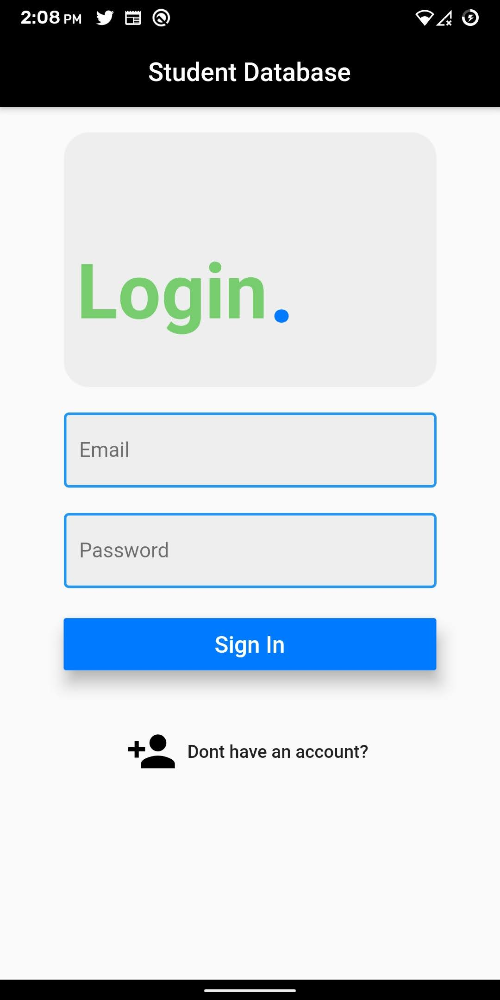
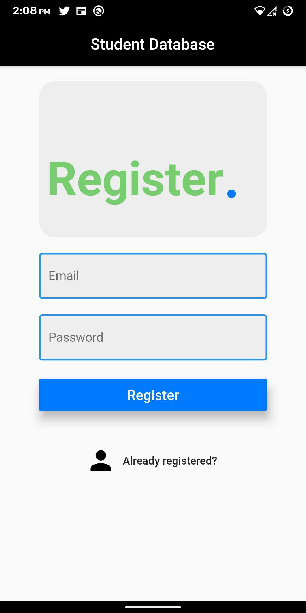
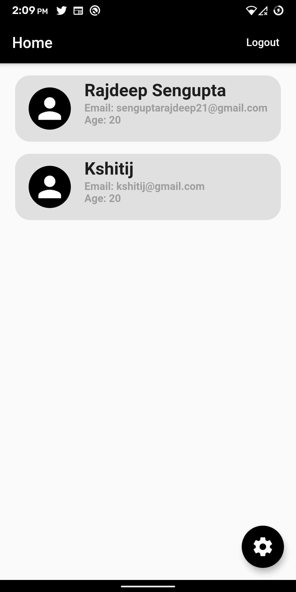
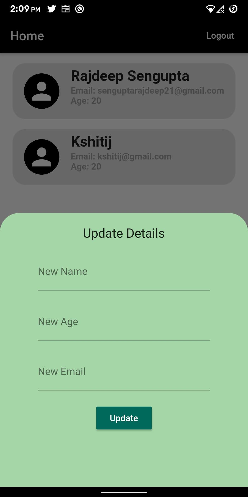

# Student Database App

App using flutter and firebase for the implementation of student database.

# Instructions 

1.Clone this repo.<br>
2.Open command line, connect your phone and write the following commands:<br>
```
flutter pub get
flutter build apk --split-per-abi
flutter install 
```

# Screens

## Login Page

<p align="center">

</p>

## Register Page

<p align="center">

</p>

## Home Page

<p align="center">

</p>

## Updating user details in Home Page 

<p align="center">

</p>


# Demo Recording of App

<a href='https://github.com/Rajdeep2121/Student-Database-App/blob/master/Screenshots/Recording.mp4?raw=true'>Click here.</a>